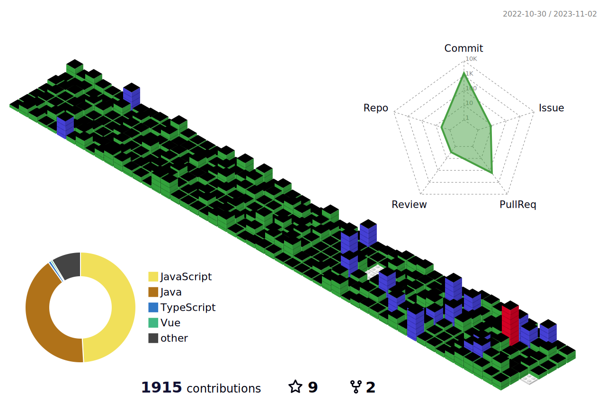

## 🧑🏻‍💻 백엔드 개발자

###  _어제보다 성장한 오늘의 모습을 오늘보다 성장할 내일의 동기부여로 활용하는 개발자_

#### 🛠️ 기술스택
- 언어: **Java, JavaScript, TypeScript**
- 프레임워크: **Spring boot, Node, Nuxt(Vue)**
- 데이터베이스: **MySQL, MongoDB**
- 인프라: **AWS, GCP, Docker**
- 협업: **Git, Github, Jira, Notion**

---

